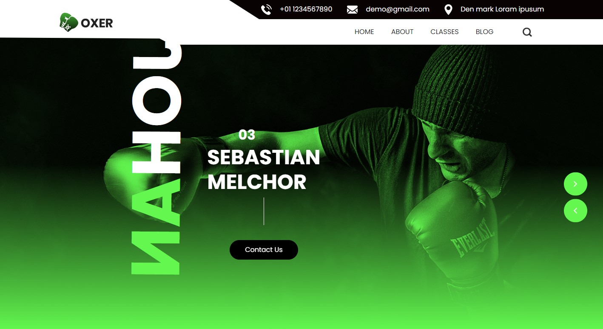
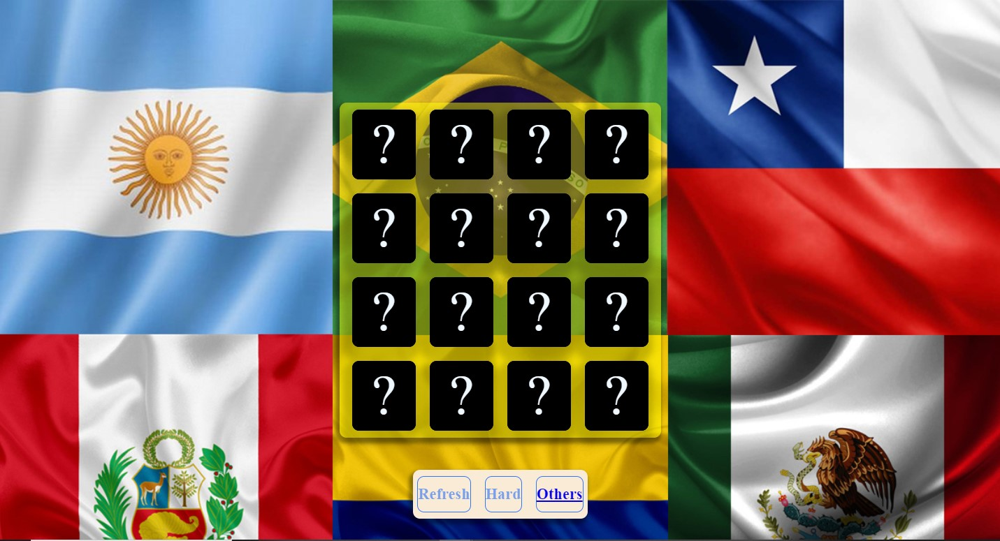

## Hi there 👋

Este proyecto de página web fue creado en clase de programación hipermedia, es una de mis primeras paginas.

Este es link de dicha pagina desplegada con zeabur (https://oxxer-html.zeabur.app)

 

Este fue mi segundo proyecto para la clase de programación hipermedia, fue un juego creado usando css, html y javascript.

Este es link para el juego desplegado desde github (https://jsmelchorg.github.io/Memory-Game/)

